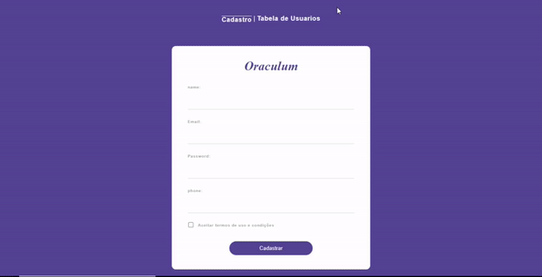

# Front-end Sistema de Cadastro

## Tabela de conteúdos
   * [Sobre](#sobre)
   * [Tecnologias](#tecnologias)
   * [Instalação](#instalação)
   * [Como rodar a aplicação](#como-rodar-a-aplicação)
      * [Front-End](#front-end)
  
## Sobre
Este repositório contém o Front-end de Sistema de Cadastro de Usuários simples no qual possui uma interface de cadastro de usuário e tabela de usuários cadastrados. Sendo utilizado para teste de monitoramento e previsão de indisponibilidade.

Para uma melhor experiência, é recomendado utilizar o Back-end deste sistema. Clique [AQUI](https://github.com/Oraculum-Fatec/sistema-cadastro-backend) para acessar o seu repositório.

## Tecnologias
- [Node](https://nodejs.org/en/)
- [Vue.js](https://br.vuejs.org/)

## Instalação
Para começar, será necessário instalar em sua máquina as seguintes ferramentas:
[Git](https://git-scm.com), [Node](https://nodejs.org/en/download/), IDE de sua preferência.

## Como Rodar a Aplicação
Segue abaixo o passo a passo para configurar e executar o Front-end:

### Front-end
Primeiramente será necessário clonar o repositório em sua máquina local com o comando:

      git clone https://github.com/Oraculum-Fatec/sistema-cadastro.git

Em seguida, para instalar as dependências:

      npm install
      
Execute o front-end com:
 
      npm run serve

## Configuração customizada
Consulte [Configuration Reference](https://cli.vuejs.org/config/).

## Demonstração

  

